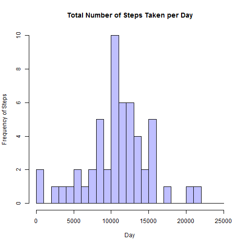
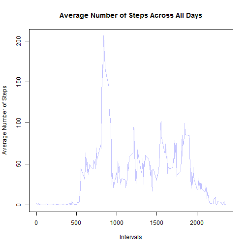
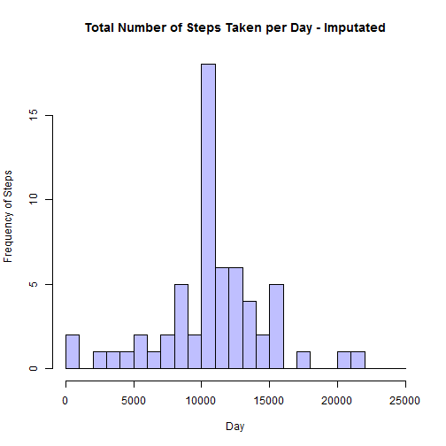
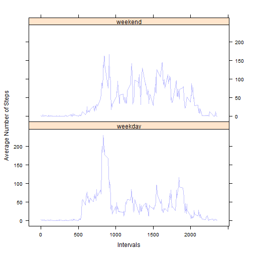

# Reproducible Research - Assignment 1
*Author: Arash Amoozegar*

## Introduction

Using the number of steps taken in 5-minute intervals data from a personal activity monitoring device which is collected from an anonymous individual during October and November of 2012 and using the help of graphs and imputation technique, I provide answers to different questions regarding the activity patterns.

## 1. Loading and Pre-Processing

### 1.1. Loading the data

I first set the working directory, then clean the workspace, and next load the main database.


```r
setwd("D:/R/Reproducible Research/Assignment_1/")
rm(list = ls())
Activity_Main_Data <- read.csv("activity.csv", header = TRUE, sep = ",", stringsAsFactors = FALSE)
```

Next, I take a look at the loaded database to verify that it has 3 variables and 17,568 observations. 


```r
str(Activity_Main_Data)
```

```
## 'data.frame':	17568 obs. of  3 variables:
##  $ steps   : int  NA NA NA NA NA NA NA NA NA NA ...
##  $ date    : chr  "2012-10-01" "2012-10-01" "2012-10-01" "2012-10-01" ...
##  $ interval: int  0 5 10 15 20 25 30 35 40 45 ...
```

### 1.2. Pre-Processing the Data

In this section, I transform the `date` variable (which is formatted as character) into R date format.


```r
Activity_Main_Data$date <- as.Date(Activity_Main_Data$date, format = "%Y-%m-%d")
```

Next, I take a look at the formatted database to verify the changes in the `date` variable.


```r
str(Activity_Main_Data)
```

```
## 'data.frame':	17568 obs. of  3 variables:
##  $ steps   : int  NA NA NA NA NA NA NA NA NA NA ...
##  $ date    : Date, format: "2012-10-01" "2012-10-01" ...
##  $ interval: int  0 5 10 15 20 25 30 35 40 45 ...
```

## 2. Mean Total Number of Steps

### 2.1. Total Number of Steps

Using the following code, I calculate the total number of steps taken per each day. As instructed, the missing values (marked as *NA*) are ignored in this calculation. I use the `head` command to take a look at the first few observations of the `Total_Steps` database.


```r
Total_Steps <- aggregate(steps ~ date, data = Activity_Main_Data, FUN = sum, na.rm = TRUE)
head(Total_Steps)
```

```
##         date steps
## 1 2012-10-02   126
## 2 2012-10-03 11352
## 3 2012-10-04 12116
## 4 2012-10-05 13294
## 5 2012-10-06 15420
## 6 2012-10-07 11015
```

### 2.2. Histogram of Total Number of Steps

I use the `hist` command to create the histogram of the total number of steps taken per day.


```r
hist(Total_Steps$steps, main = "Total Number of Steps Taken per Day", xlab = "Day", ylab = "Frequency of Steps", col = rgb(0,0,1,1/4), breaks = seq(0, 25000, 1000))
```

 

### 2.3. Mean and Median

Using `mean` and `median` commands, I calculate these two measures of central tendency for total number of steps. 


```r
cat("Mean Total Number of Steps: ",mean(Total_Steps$steps, na.rm = TRUE))
```

```
## Mean Total Number of Steps:  10766.19
```

```r
cat("Median Total Number of Steps: ",median(Total_Steps$steps, na.rm = TRUE))
```

```
## Median Total Number of Steps:  10765
```

As indicated in the output, the mean and median of total number of steps taken per day is 10,766.19 and 10,765, respectively. 

## 3. Average Daily Activity Pattern

### 3.1. Time-Series Plot

I first create a database for the average number of steps taken across all days for each of the 5-minute intervals. Next, using the `plot` command, I create the time-series plot.


```r
Mean_Steps <- aggregate(steps ~ interval, data = Activity_Main_Data, FUN = mean, na.rm = TRUE)
plot(Mean_Steps$interval, Mean_Steps$steps, type = "l", xlab = "Intervals", ylab = "Average Number of Steps", main = "Average Number of Steps Across All Days", col = rgb(0,0,1,1/4))
```

 

### 3.2. Interval with Maximum Number of Steps

The following code provides the 5-minute interval with maximum number of steps.


```r
cat("Interval with Maximum Number of Steps:",Mean_Steps[which.max(Mean_Steps$steps),1])
```

```
## Interval with Maximum Number of Steps: 835
```

I see that the 835th interval has the highest number of steps on average across all days.

## 4. Missing Values

### 4.1. Total Number of Missing Values

This code provides the total number of missing values in the database.


```r
cat("Total Number of Missing Values:",sum(is.na(Activity_Main_Data)))
```

```
## Total Number of Missing Values: 2304
```

There are 2,304 observations with missing values in the database.

### 4.2. and 4.3. Imputation Strategy and New Dataset

My strategy for imputing the missing values is to replace them with the mean of the number of steps taken at the same interval throughout the whole sample. In order to accomplish this, I first find the mean number of steps taken for each interval. I next merge this new data back into the original dataset by using the `interval` variable as merge ID. Next, I replace all the missing values with the calculated mean. 


```r
Mean_Steps <- aggregate(steps ~ interval, data = Activity_Main_Data, FUN = mean, na.rm = TRUE)
Activity_Main_Data_Imp <- merge(Activity_Main_Data, Mean_Steps, by = "interval")
Activity_Main_Data_Imp$steps.x[is.na(Activity_Main_Data_Imp$steps.x)] <- Activity_Main_Data_Imp$steps.y[is.na(Activity_Main_Data_Imp$steps.x)]
Activity_Main_Data_Imp$steps.y <- NULL
colnames(Activity_Main_Data_Imp)[2] <- "steps"
```

Here, I check the new imputed database to verify that there are no missing observations anymore. 


```r
cat("Total Number of Missing Values:",sum(is.na(Activity_Main_Data_Imp)))
```

```
## Total Number of Missing Values: 0
```

### 4.4. Histogram, Mean, and Median

I use the same codes that I used previously to make the histogram of the total number of steps taken per day and find the mean and median.


```r
Total_Steps <- aggregate(steps ~ date, data = Activity_Main_Data_Imp, FUN = sum)
hist(Total_Steps$steps, main = "Total Number of Steps Taken per Day - Imputated", xlab = "Day", ylab = "Frequency of Steps", col = rgb(0,0,1,1/4), breaks = seq(0, 25000, 1000))
```

 

```r
cat("Mean Total Number of Steps: ",mean(Total_Steps$steps))
```

```
## Mean Total Number of Steps:  10766.19
```

```r
cat("Median Total Number of Steps: ",median(Total_Steps$steps))
```

```
## Median Total Number of Steps:  10766.19
```

As indicated here, the mean and median of the total number of steps taken are both 10,766.19. The mean imputation did not change the mean and had a very small effect on the median (**Note: I also imputated the missing values with the median of the number of steps taken at the same interval throughout the whole sample. The resulting mean and median of total number of steps taken is 9,503.869 and 10,395, respectively.**).

## 5. Weekdays vs. Weekends

### Weekday and Weekend Variable

As instructed, I first create a factor variable called `w_level` which takes "weekday" for Mondays to Fridays and takes "weekend" for Saturdays and Sundays. To achieve this, a variable `d_level` is created which holds the name of the day for each of the dates. Then, using the `ifelse` command, the name of the day is converted to the "weekday" and "weekend" and stored in `w_level` variable.


```r
d_level <- weekdays(Activity_Main_Data_Imp$date)
Activity_Main_Data_Imp$d_level <- c(d_level)
Activity_Main_Data_Imp <- cbind(Activity_Main_Data_Imp, w_level = ifelse(Activity_Main_Data_Imp$d_level == "Saturday" | Activity_Main_Data_Imp$d_level == "Sunday", "weekend", "weekday"))
Activity_Main_Data_Imp$d_level <- NULL
```

I take a look at the database to confirm the levels of its new variable `w_level`.


```r
str(Activity_Main_Data_Imp$w_level)
```

```
##  Factor w/ 2 levels "weekday","weekend": 1 1 2 1 2 1 2 1 1 2 ...
```

### Panel Plot

In order to make a panel plot for comparing the average number of steps taken for weekdays and weekends, I first create a datebase that contains the averages for both levels of `w_level` variable. I use the `xyplot` command in the `lattice` library to create the panel plot similar to the provided example.


```r
library(lattice)
Total_Steps <- aggregate(steps ~ interval + w_level, data = Activity_Main_Data_Imp, FUN = mean)
xyplot(steps ~ interval | w_level, data = Total_Steps, type = "l", xlab = "Intervals", ylab = "Average Number of Steps", layout = c(1,2), col = rgb(0,0,1,1/4))
```

 
